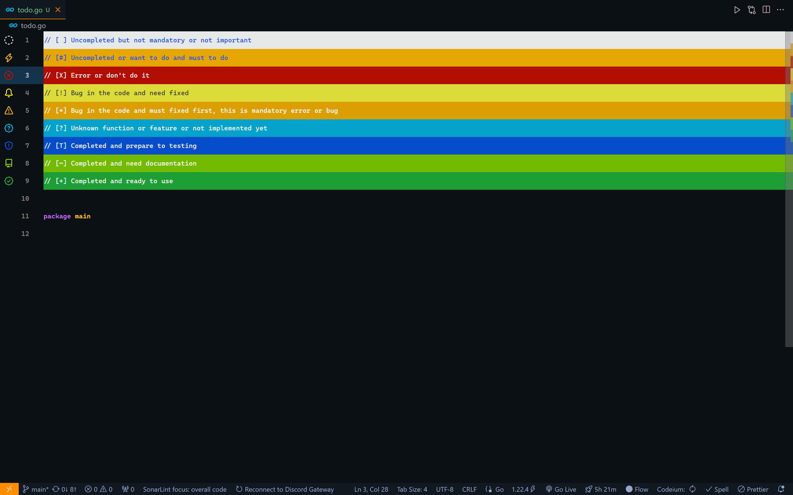

# Todo Compact Design

[](#)
[](#)

Compact design for Todo Tree extension in Visual Studio Code. Designed to create a todo list that is easy to read and efficient. It uses a simple and clean design with a focus on readability.




## Tags
✔️ `[ ]` Uncompleted but not mandatory or not important

✔️ `[#]` Uncompleted or want to do and must to do

✔️ `[X]` Error or don't do it

✔️ `[!]` Bug in the code and need fixed

✔️ `[*]` Bug in the code and must fixed first, this is mandatory error or bug

✔️ `[?]` Unknown function or feature or not implemented yet

✔️ `[T]` Completed and prepare to testing

✔️ `[~]` Completed and need documentation

✔️ `[+]` Completed and ready to use

## Tag Highlights
The default custom tag highlights is based on the [Todo Tree](https://github.com/Gruntfuggly/todo-tree) extension with the following configuration:

### Tag `[ ]`
Explain the code or function **uncompleted** but not mandatory or not important. Usually using for create process flow using command and coding after flow completed.

Default tag highlights configuration:
```
"[ ]": {
    "icon": "issue-draft",
    "type": "whole-line",
    "foreground": "#0045f2",
    "background": "#FFFFFF",
    "iconColour": "#FFFFFF",
    "borderRadius": "0px",
    "rulerOpacity": 0.9,
    "opacity": 0.9,
    "gutterIcon": true
}
```

### Tag `[#]`
Explain the code or function **uncompleted** or want to do and must to do. Use this to create **important** code or function.

Default tag highlights configuration:
```
"[#]": {
    "icon": "zap",
    "type": "whole-line",
    "foreground": "#0045f2",
    "background": "#ffb700",
    "iconColour": "#ffb700",
    "borderRadius": "0px",
    "rulerOpacity": 0.9,
    "opacity": 0.9,
    "gutterIcon": true
}
```

### Tag `[X]`
Explain the code or function **error** or **don't do it**. Use this tag to debug and mark the code or function error. Besides that it can use to forbid something.

Default tag highlights configuration:
```
"[X]": {
    "icon": "x-circle",
    "type": "whole-line",
    "foreground": "#ffffff",
    "background": "#c40d00",
    "iconColour": "#c40d00",
    "borderRadius": "0px",
    "rulerOpacity": 0.9,
    "opacity": 0.9,
    "gutterIcon": true
}
```

### Tag `[!]`
Explain the code or function **bug** and **not important**. Use this tag to debug and mark the code or function bugged and need fixed later but not critical effect.

Default tag highlights configuration:
```
"[!]": {
    "icon": "bell",
    "type": "whole-line",
    "foreground": "#2d2e2f",
    "background": "#ffff40",
    "iconColour": "#ffff00",
    "borderRadius": "0px",
    "rulerOpacity": 0.85,
    "opacity": 0.85,
    "gutterIcon": true
}
```

### Tag `[*]`
Explain the code or function **bug** and **important**. Use this tag to debug and mark the code or function bugged and need fixed before recompile or running the program. Marked code using this tag may there is an critical effect and program can't compiled.

Default tag highlights configuration:
```
"[*]": {
    "icon": "alert",
    "type": "whole-line",
    "foreground": "#FFFFFF",
    "background": "#ffb700",
    "iconColour": "#ffb700",
    "borderRadius": "0px",
    "rulerOpacity": 0.85,
    "opacity": 0.85,
    "gutterIcon": true
}
```

### Tag `[?]`
Sometimes there are function or lines of code whose function is not clear or not very important. Maybe a refactor could be done or have no documentation. Use this tag to mark the code can refactor or re-understood.

Default tag highlights configuration:
```
"[?]": {
    "icon": "unverified",
    "type": "whole-line",
    "foreground": "#FFFFFF",
    "background": "#03bdeb",
    "iconColour": "#03bdeb",
    "borderRadius": "0px",
    "rulerOpacity": 0.85,
    "opacity": 0.85,
    "gutterIcon": true
}
```

### Tag `[T]`
Function or code has been write and need to testing before compiling or deployment.

Default tag highlights configuration:
```
"[T]": {
    "icon": "shield",
    "type": "whole-line",
    "foreground": "#FFFFFF",
    "background": "#0358eb",
    "iconColour": "#0358eb",
    "borderRadius": "0px",
    "rulerOpacity": 0.85,
    "opacity": 0.85,
    "gutterIcon": true
}
```

### Tag `[~]`
Function or code has been write and need create documentation deployment.

Default tag highlights configuration:
```
"[~]": {
    "icon": "repo",
    "type": "whole-line",
    "foreground": "#FFFFFF",
    "background": "#85d800",
    "iconColour": "#85d800",
    "borderRadius": "0px",
    "rulerOpacity": 0.85,
    "opacity": 0.85,
    "gutterIcon": true
}
```

### Tag `[+]`
Function or code has been write and ready to compiling or deploy. Ensure the code must complete the testing step and have clean documentation. 

Default tag highlights configuration:
```
"[+]": {
    "icon": "verified",
    "type": "whole-line",
    "foreground": "#FFFFFF",
    "background": "#21b83c",
    "iconColour": "#21b83c",
    "borderRadius": "0px",
    "rulerOpacity": 0.85,
    "opacity": 0.85,
    "gutterIcon": true
}
```

## Requirements
To use this configuration, you need to have:
* [Visual Studio Code](https://code.visualstudio.com/)
* [Todo Tree](https://marketplace.visualstudio.com/items?itemName=Gruntfuggly.todo-tree)

## Configuration
### How to configure
1. Open the Command Palette in VS Code by pressing `Ctrl + Shift + P` (Windows/Linux) or `Cmd + Shift + P` (macOS).
2. Type "Preferences: Open User Settings" and select the option from the dropdown list.
3. In the opened settings.json file, add or replace the `todo-tree.general.tags` with the following lines:
    ```
    "todo-tree.general.tags": [
        "[ ]",
        "[#]",
        "[X]",
        "[!]",
        "[*]",
        "[?]",
        "[T]",
        "[~]",
        "[+]"
    ],  
    ```
4. Then find `todo-tree.highlights.customHighlight` and replace or add custom config with following lines:
    ```
    "todo-tree.highlights.customHighlight": {
        "[ ]": {
            "icon": "issue-draft",
            "type": "whole-line",
            "foreground": "#0045f2",
            "background": "#FFFFFF",
            "iconColour": "#FFFFFF",
            "borderRadius": "0px",
            "rulerOpacity": 0.9,
            "opacity": 0.9,
            "gutterIcon": true
        },
        "[#]": {
            "icon": "zap",
            "type": "whole-line",
            "foreground": "#0045f2",
            "background": "#ffb700",
            "iconColour": "#ffb700",
            "borderRadius": "0px",
            "rulerOpacity": 0.9,
            "opacity": 0.9,
            "gutterIcon": true
        },
        "[X]": {
            "icon": "x-circle",
            "type": "whole-line",
            "foreground": "#ffffff",
            "background": "#c40d00",
            "iconColour": "#c40d00",
            "borderRadius": "0px",
            "rulerOpacity": 0.9,
            "opacity": 0.9,
            "gutterIcon": true
        },
        "[!]": {
            "icon": "bell",
            "type": "whole-line",
            "foreground": "#2d2e2f",
            "background": "#ffff40",
            "iconColour": "#ffff00",
            "borderRadius": "0px",
            "rulerOpacity": 0.85,
            "opacity": 0.85,
            "gutterIcon": true
        },
        "[*]": {
            "icon": "alert",
            "type": "whole-line",
            "foreground": "#FFFFFF",
            "background": "#ffb700",
            "iconColour": "#ffb700",
            "borderRadius": "0px",
            "rulerOpacity": 0.85,
            "opacity": 0.85,
            "gutterIcon": true
        },
        "[?]": {
            "icon": "unverified",
            "type": "whole-line",
            "foreground": "#FFFFFF",
            "background": "#03bdeb",
            "iconColour": "#03bdeb",
            "borderRadius": "0px",
            "rulerOpacity": 0.85,
            "opacity": 0.85,
            "gutterIcon": true
        },
        "[T]": {
            "icon": "shield",
            "type": "whole-line",
            "foreground": "#FFFFFF",
            "background": "#0358eb",
            "iconColour": "#0358eb",
            "borderRadius": "0px",
            "rulerOpacity": 0.85,
            "opacity": 0.85,
            "gutterIcon": true
        },
        "[~]": {
            "icon": "repo",
            "type": "whole-line",
            "foreground": "#FFFFFF",
            "background": "#85d800",
            "iconColour": "#85d800",
            "borderRadius": "0px",
            "rulerOpacity": 0.85,
            "opacity": 0.85,
            "gutterIcon": true
        },
        "[+]": {
            "icon": "verified",
            "type": "whole-line",
            "foreground": "#FFFFFF",
            "background": "#21b83c",
            "iconColour": "#21b83c",
            "borderRadius": "0px",
            "rulerOpacity": 0.85,
            "opacity": 0.85,
            "gutterIcon": true
        }
    }
    ```
### Complete Configuration
If you feel lazy you can just copy paste into your vscode setting file. All configuration saved in file `vscode_setting.json`.

Read full configuration file for VSCode [here](vscode_setting.json).

## Thanks To
* [Gruntfuggly](https://github.com/Gruntfuggly) - Todo Tree

## License
This project is licensed under the MIT License - see the [LICENSE.md](LICENSE.md) file for details.
